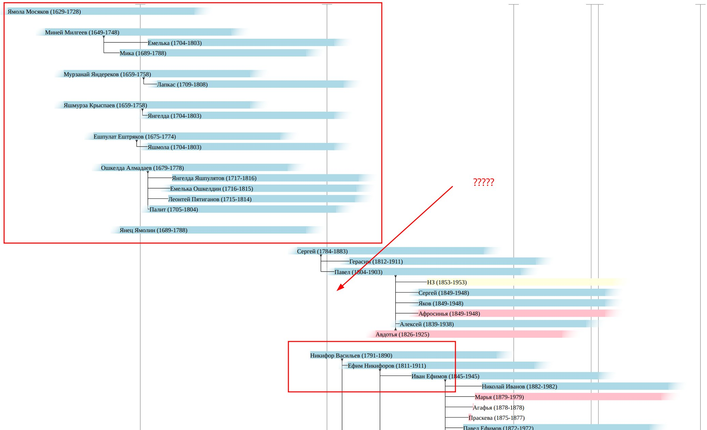

Title: Некоторые листы девятой ревизии
Date: 2025-05-08 11:58
Category: Статьи
Tags: Новости
Slug: persons_from_9_revision

На днях получил некоторые листы по девятой ревизии по моей ветке. Добавил их в дерево. Это позволило опуститься по моим родственникам до конца 18-ого века. Совсем чуть чуть и удастся связать ветку до черемисских имен нулевой и первой ревизии.

- [Никифор Васильев]({filename}persons/I0325.md)
- [Ефим Никифоров]({filename}persons/I0327.md)

Можно предположить, что отца Никифора звали Василий, который родился примерно в 1770-ых годах. А стало быть он должен засветится в четвертой ревизии. У меня есть третья ревизия. Но даже ее читать очень сложно. Скорее всего четвертую надо будет заказывать с расшифровкой.

